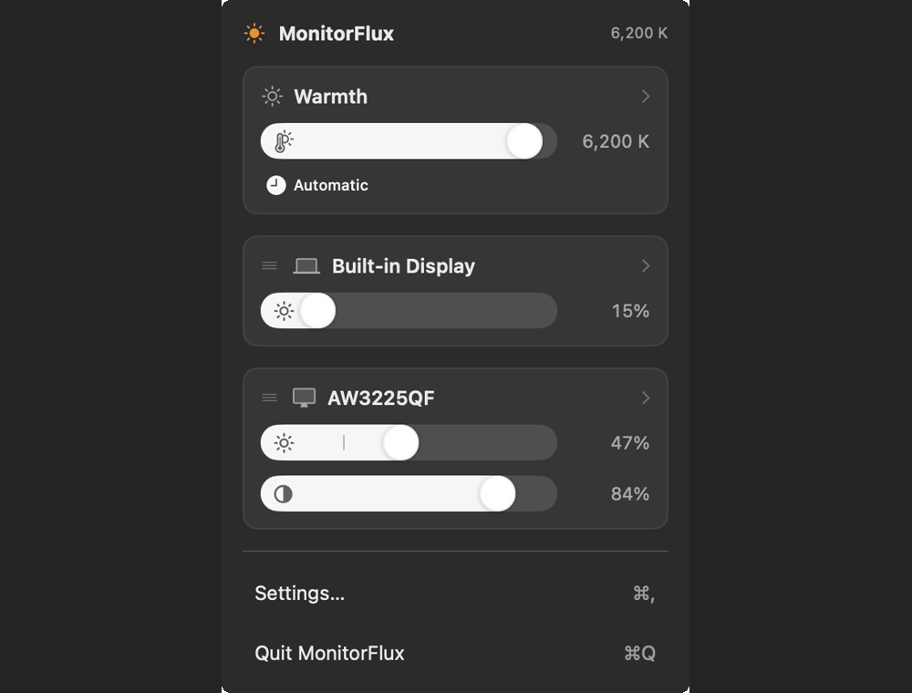

# MonitorFlux

MonitorFlux is a menu-bar display controller for Mac users who want
**MonitorControl-style monitor sliders** and **f.lux-style warmth scheduling** in
one app.

Use it when an external monitor stays too bright at night, your brightness keys
only control the built-in screen, or you want warmth, brightness, and contrast to
follow one day/night schedule. MonitorFlux uses real monitor controls when they
exist, then falls back to software dimming or an AirPlay overlay when they do not.



## Why use it

- **Control real monitor brightness from the menu bar.** External displays get
  brightness, contrast, and volume sliders over DDC/CI; the built-in display uses
  its real backlight. Optionally, external displays can follow the built-in
  display's brightness one-way — ambient-light changes and the brightness keys
  carry over, with each display keeping its own offset — and a manual contrast
  change can be copied across externals. Displays with their own schedule stay
  on it.
- **Warm the screen on a schedule.** Fixed and Automatic warmth modes cover the
  f.lux/Night Shift use case without giving up per-display monitor controls.
- **Schedule monitor levels too.** External-display brightness and contrast can
  ride the same day/night timeline as warmth, so night mode is not just a color
  tint.
- **Keep non-DDC displays usable.** When hardware brightness is unavailable,
  MonitorFlux falls back to software dimming; AirPlay/virtual displays use a
  darker-only overlay.
- **Stay out of your way.** It is menu-bar-first, has native-looking OSD feedback,
  and can keep the Dock icon hidden unless the settings window is open.

## MonitorFlux vs MonitorControl

[MonitorControl](https://github.com/MonitorControl/MonitorControl) is the mature
baseline for external monitor control. MonitorFlux is for people who want that
style of control plus warmth and scheduled day/night levels in the same app.

| Feature | MonitorFlux | MonitorControl |
|---|---|---|
| Menu-bar sliders per display | Yes | Yes |
| External brightness / contrast / volume over DDC | Yes | Yes |
| Built-in display brightness | Yes, real backlight | Yes, native Apple protocol |
| Software dimming below the hardware floor | Yes, gamma or overlay | Yes, gamma or shade |
| AirPlay / virtual display dimming | Yes, overlay | Yes, shade |
| Standard brightness and media keys | Yes, routed to the display under the pointer | Yes |
| Custom keyboard shortcuts | Yes | Yes |
| Native brightness / volume OSD | Yes | Yes |
| Warmth / color temperature control | Built in | Requested separately |
| Day/night warmth schedule | Built in | Not advertised |
| Follow-sunset schedule | Built in, computed on-device | Not advertised |
| Per-display brightness / contrast schedule | Built in | Requested separately |
| Externals follow built-in brightness (ambient light, keys) | Yes | Yes |

MonitorControl's column is based on its public README and public feature
requests for [color temperature](https://github.com/MonitorControl/MonitorControl/issues/989)
and [day/night presets](https://github.com/MonitorControl/MonitorControl/issues/1851).

## How it works

MonitorFlux has two separate control paths:

- **Color / software path:** color temperature (warmth) and software brightness. These
  are pixel-level adjustments made by rewriting the display's gamma table. (AirPlay/wireless
  displays ignore gamma, so their software dimming uses a black overlay window instead.)
- **Hardware (DDC) path:** brightness and contrast commands sent to an external monitor's
  firmware over DDC/CI, using native macOS APIs first, with the `ddcctl` command-line tool
  only as an optional fallback if it already exists on the machine.

Warmth can be turned off entirely. When it is, MonitorFlux restores the system color
tables and stops writing gamma. The hardware controls keep working either way.

## What the brightness percentages mean

A brightness slider's `0%`/`100%` is **not** a percentage of the panel's physical light
output (nits). One "Brightness" label sits over three different mechanisms, so the numbers
mean different things depending on the display:

| Path | `0%` means | `100%` means |
|---|---|---|
| **External monitor (DDC)** | the monitor's **minimum** brightness — dim but still **lit**, not black | the monitor's max for its current **SDR** picture mode — **not** its HDR/peak capability |
| **Built-in, real backlight** | the dimmest backlight (still lit) | the panel's **true** maximum |
| **Built-in, software dimming** (gamma, when no backlight API) | a software-darkened, near-black image | **neutral — no change**; it can't exceed the backlight (the slider even allows up to 150%, a clipped fake-boost) |

For an external monitor the slider sends DDC/CI VCP code `0x10` ("luminance") straight to
the panel — the exact control the monitor's own brightness buttons use. So:

- **`0%` is not black.** Monitors keep the backlight lit at a deliberate floor; "0
  brightness" never means pixels-off. To go black, sleep the display.
- **`100%` is not the panel's peak.** DDC only moves the SDR brightness, so on an HDR/OLED
  monitor `100%` sits well below its HDR highlight nits — same as holding the monitor's
  brightness-up button to the top.

## DDC vs gamma dimming — which to use

**For actually dimming brightness, DDC (real backlight) wins.** Gamma dimming is for color
warming, for going *below* the hardware floor, or as a fallback when DDC/backlight isn't
available. The difference: DDC lowers the monitor's **actual backlight** (fewer photons);
gamma leaves the backlight at full power and just tells the GPU to output **darker pixels**.

| | **DDC** (real backlight) | **Gamma** (software) |
|---|---|---|
| Real light reduction? | **Yes** — fewer photons, easier on the eyes | No — backlight unchanged; only the signal is darkened |
| Image quality | full bit depth & contrast preserved | **banding / posterization** — scaling values into a smaller range loses precision |
| Contrast (LCD) | unchanged | **drops** — blacks stay lit, so they gray out vs dimmed whites |
| Power / OLED wear | **lower** (less emission) | no savings |
| Where it works | external monitors only (DDC/CI) | **any wired** display, incl. the built-in (AirPlay/wireless ignore gamma — those use an overlay) |
| Speed | slower (I²C bus) | instant (GPU-side) |
| Color temperature | can't | **only** way to warm color |
| How low it goes | stops at the monitor's lit floor | can go much darker, toward black |

Gamma genuinely wins for: warming color temperature (the f.lux-style night warmth), dimming
**below** the hardware minimum (a pitch-dark room), the **universal fallback** for the
built-in panel or any monitor without DDC, and avoiding **PWM** flicker (hold the backlight
high, dim via gamma). MonitorFlux follows this: hardware for brightness (DDC for external,
the real backlight for built-in), gamma for color warmth and as the brightness fallback.

Night-use tip: **DDC/backlight to dim + gamma only to warm** — real light reduction without
the banding, plus the warm tone. Stacking gamma brightness on an already-low backlight is
where banding shows up, so lean on the hardware slider for brightness and the ambience slider
for warmth.

## The app

- The **menu bar popup** is modeled after MonitorControl: a card per display with live
  brightness, contrast, and volume sliders, plus a global warmth (color-temperature) slider
  and an Off/Fixed/Automatic mode. (On a schedule, dragging the warmth slider re-warms the
  phase that's active right now and stays Automatic, rather than switching to Fixed.) Cards
  **drag-to-reorder** by their grip with an iOS-app-icon lift-and-shuffle animation, and DDC
  writes are throttled so dragging doesn't flood the monitor. The app is menu-bar-first; a
  "Show in Dock" setting (off by default) gives the settings window a Dock icon and ⌘-Tab
  while it's open, disappearing again when you close it.
- The **on-screen display** flashes a level bezel when a control changes by keyboard.
  Brightness and volume reuse the same bezel macOS itself draws, so they look identical;
  contrast and warmth (which macOS has no bezel for) use a matching custom panel.
- The **Schedule** screen is modeled after f.lux preferences: three phase temperatures
  (Daytime / Sunset / Bedtime), a phase selector, a draggable three-handle schedule curve,
  **wake / sunset / bedtime** time steppers, and a **Set times / Follow sunset** source. In
  **Follow sunset** mode the sunset time comes from your location and the curve, dots, and
  steppers show that computed sunset — but **wake and bedtime stay the times you set** (f.lux
  does the same: only sunset follows the sun, so the screen doesn't jump to daytime at the
  ~5 AM summer sunrise). A **"now" marker** rides the curve at the current time. **Drag it to
  preview** how the screen will look at any time of day — the warmth *and* any scheduled
  brightness/contrast — and it adopts the **Automatic** schedule if you weren't already on it.
  The preview is always temporary: it resets when you leave or reload the Schedule screen,
  switch away from the window, or change the mode. In-app ⓘ tooltips are short summaries; the
  deeper explanations live here in the README.
- Each **Display** screen keeps the monitor's everyday controls — brightness and contrast
  (DDC), or the built-in backlight — on the main pane, with warmth enablement on top. **Show
  Advanced Settings** reveals software gamma dimming, the day/night brightness & contrast
  schedule, and monitor extras (volume, DDC index). **AirPlay/wireless** displays get a
  stripped-down pane — overlay dimming only — because they have no hardware controls and ignore
  gamma.
- The settings window supports **⌘+ / ⌘− / ⌘0** to zoom its text. The chosen size is
  remembered, and controls stay clickable at every zoom.

## Keyboard control

When enabled (Settings ▸ Keyboard), MonitorFlux taps the keyboard's brightness and
volume media keys and routes them to the external display **under your pointer** over
DDC — so the same keys that dim the built-in panel now drive whichever monitor you're
pointing at. Hold **Control** with the brightness keys to change contrast, **Shift**
with the brightness keys to make global warmth warmer/cooler, or **Command** with the
brightness keys to drive the built-in panel's own backlight. This media-key path must
be enabled in Settings and needs Accessibility permission (System Settings ▸ Privacy &
Security ▸ Accessibility), since intercepting media keys is privileged. The built-in
display's brightness slider in the popup and detail window drives the real backlight;
custom shortcuts also include built-in-only brightness/contrast actions.

## Avoiding color conflicts

Gamma is a single, shared resource. macOS **Night Shift** and apps like **f.lux** also
rewrite the gamma tables, so running them alongside MonitorFlux makes the two fight —
colors flicker or look wrong. MonitorFlux shows a warning on the Schedule screen with a
shortcut to Display settings; disable Night Shift and quit other color tools for correct
results. ⓘ buttons in the UI explain gamma vs DDC for newcomers.

## DDC caveats

DDC/CI support depends on the monitor, cable, dock, GPU path, and what macOS exposes.
Built-in displays do not use DDC. MonitorFlux uses native macOS DDC APIs — architecture-specific,
and private on Apple Silicon (the same approach MonitorControl and Lunar use); the `ddcctl`
command-line tool is an optional Intel-only fallback used only when it's already installed and
the native path fails. DDC over a Mac's built-in HDMI port is generally unsupported — use
USB-C/DisplayPort. The private API is fine for a personal app but is not App-Store-safe.

## Run

```sh
./script/build_and_run.sh
```

Useful variants:

```sh
./script/build_and_run.sh --safe       # drive the UI but write no gamma/DDC/backlight
./script/build_and_run.sh --verify
./script/build_and_run.sh --logs
./script/build_and_run.sh --telemetry
```

**Safe mode** (`--safe`, also used by `--verify` and `smoke_test.sh`) runs the full app
without any gamma/DDC/backlight writes, so testing doesn't flicker your screen or conflict
with f.lux/MonitorControl. Use the plain `run` (no flag) when you actually want MonitorFlux to
control your displays. See [docs/DEVELOPMENT.md](docs/DEVELOPMENT.md) for the full breakdown of
what it disables.

## Package a .dmg

```sh
./script/make_dmg.sh      # -> dist/MonitorFlux-<version>.dmg
```

Builds an optimized release bundle and a compressed disk image with a drag-to-Applications
layout. The app is ad-hoc signed, so the first launch needs a right-click ▸ Open to clear
Gatekeeper.

For a friction-free, double-click-to-open download, sign + notarize:

```sh
SIGN_IDENTITY="Developer ID Application: Your Name (TEAMID)" \
NOTARY_PROFILE="MonitorFlux" ./script/make_dmg.sh
```

This app needs **no special entitlements** to notarize — its private APIs work under the
hardened runtime. Full setup (Developer ID cert, `notarytool` credentials, verification) is
in [docs/DEVELOPMENT.md](docs/DEVELOPMENT.md).

## Test

```sh
swift test
```

The tests cover schedule math, gamma composition, gamma planning, DDC packet
construction, and preference migration/normalization.

For UI/integration regressions that unit tests can't catch (the window not opening, opening
blank, opening duplicates, or opening off-screen), there's a launch smoke test:

```sh
./script/smoke_test.sh
```

See [docs/DEVELOPMENT.md](docs/DEVELOPMENT.md) for what it asserts and the full
screenshot/verification toolkit.

## For developers

The design and contributor docs live in [docs/](docs/):

- [docs/DESIGN.md](docs/DESIGN.md) — how the non-obvious parts work and why (the single gamma
  writer, the unified brightness slider, the schedule model, the OSD bezel, settings-window zoom).
- [docs/DEVELOPMENT.md](docs/DEVELOPMENT.md) — safe mode, the UI test/screenshot hooks, and
  Developer ID signing + notarization.
- [AGENTS.md](AGENTS.md) — the architecture map and engineering rules for anyone (or any agent)
  changing the code.

## Acknowledgements

MonitorFlux's Apple Silicon DDC, built-in backlight, media-key handling, native OSD bezel, and
AirPlay overlay dimming (the "shade") were developed by studying
[MonitorControl](https://github.com/MonitorControl/MonitorControl) (MIT). See
[ACKNOWLEDGEMENTS.md](ACKNOWLEDGEMENTS.md) for details and the full license.

The offline city/ZIP search in the Follow-sunset schedule is built from
[GeoNames](https://www.geonames.org/) place data (licensed
[CC BY 4.0](https://creativecommons.org/licenses/by/4.0/)) and US ZIP-code-area centroids from
the [US Census Bureau ZCTA gazetteer](https://www.census.gov/geographies/reference-files/time-series/geo/gazetteer-files.html)
(public domain). The data is bundled so the schedule computes on-device, with nothing sent to a
geocoding service.

## License

MonitorFlux is licensed under the GNU Affero General Public License v3.0. See
[LICENSE](LICENSE).
